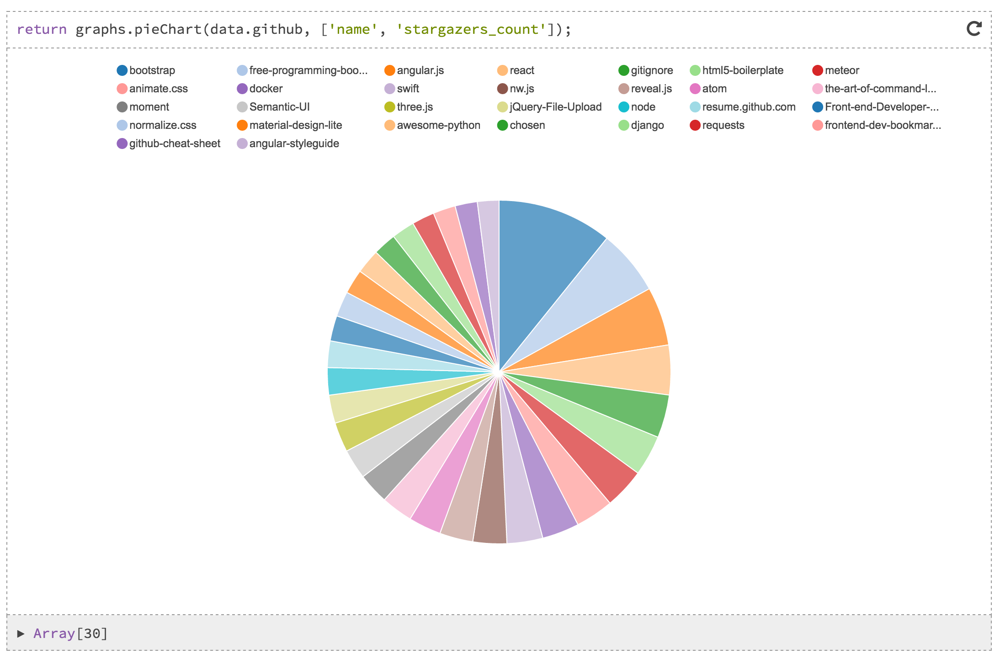

# Jutsu

Jutsu is a very simple graphing library for the web, with support for [Smolder](https://github.com/JoelOtter/smolder) built-in.

This means it can attempt to handle any data that's thrown at it, regardless of structure, and produce a graph.

To see examples, and read the documentation, check out [this notebook](http://www.joelotter.com/jutsu).



## Installation

`npm install jutsu`

Jutsu works fine on its own, but to get the automatic data reshaping, you'll need Smolder too.

`npm install smolder`

## Usage

```javascript
var Smolder = require('smolder');
var Jutsu = require('jutsu');

// graphElement is the DOM element where we want to put the graphs.
var graphs = Smolder(Jutsu(graphElement));

// We can then create a graph using, e.g.:
graphs.pieChart(data);
```

## Graphs

The optional parameter **[hints]** is a string, or array of strings, which tells Jutsu which part of the data we are interested in.

### `pieChart(data, [hints])`

### `barChart(data, xLabel, yLabel, [hints])`

### `lineChart(data, xLabel, yLabel, [hints])`

### `scatterPlot(data, xLabel, yLabel, [hints])`

Each function will return the reshaped data.

## Questions/feedback?

If you have any issues, please file an issue. If your problem is with the way the data is reshaped, please file your issue over at [Reshaper](http://github.com/JoelOtter/reshaper), the library that does all the heavy lifting.

Jutsu is a part of my Master's project at Imperial College London, and as part of my evaluation I'd really love to hear any feedback you might have. Feel free to [shoot me an email](mailto:joel.auterson@gmail.com).
